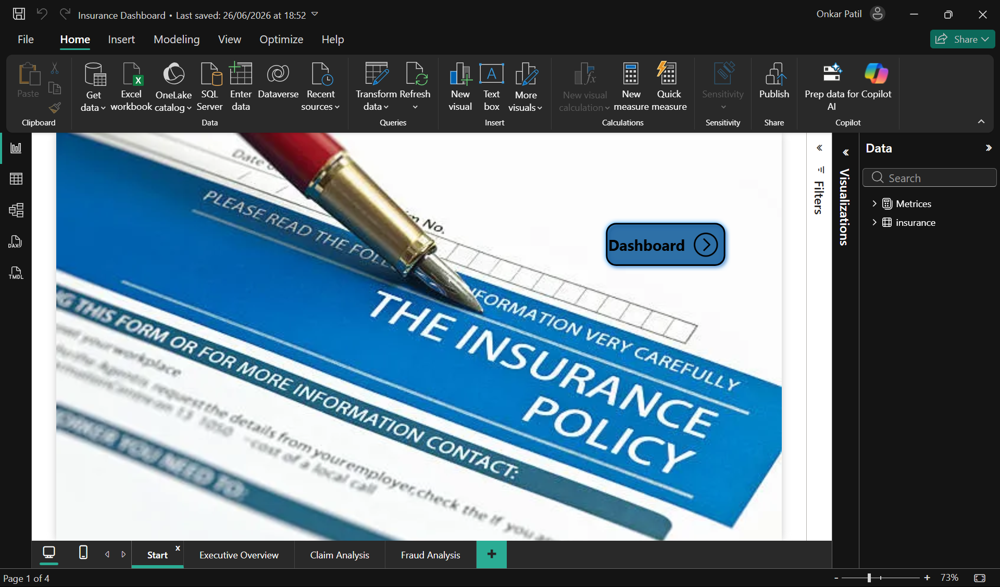
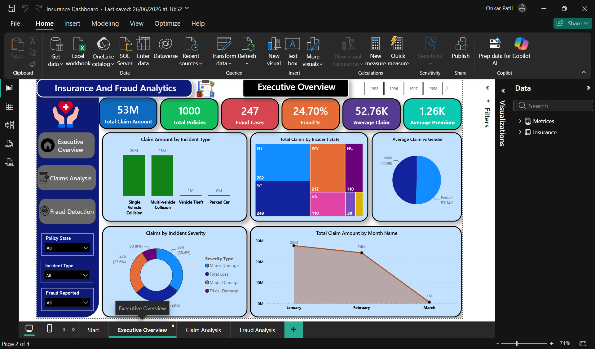
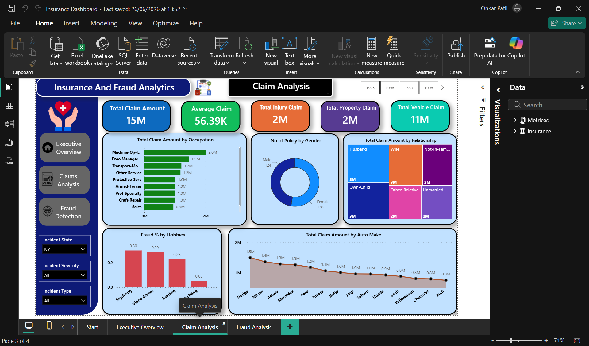
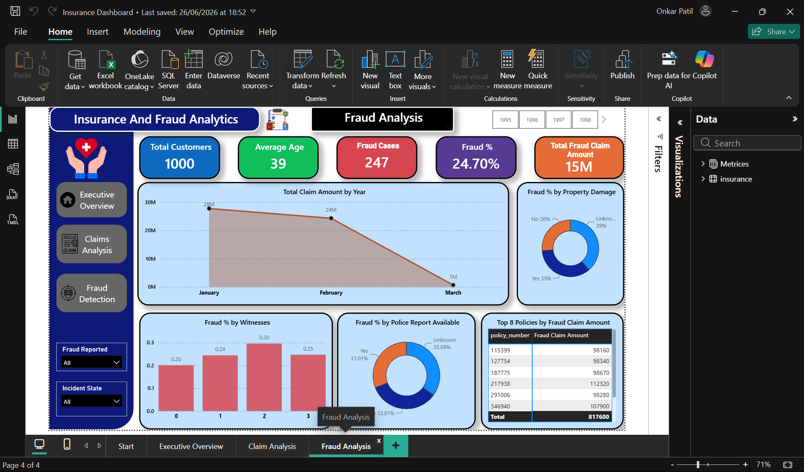

# 📊 Insurance & Fraud Analytics Dashboard | Power BI


---

## 📌 Project Overview

The **Insurance & Fraud Analytics Dashboard** is an interactive **Power BI Business Intelligence project** developed to analyze insurance policies, customers, claims, claim severity, vehicle information, and fraudulent activities.

This project transforms raw insurance data into meaningful business insights using **Power Query, DAX, data modeling, KPIs, interactive visualizations, slicers, filters, and dashboard navigation**.

The primary goal of this project is to help insurance analysts and decision-makers understand **claim performance, customer patterns, claim trends, and fraudulent activities** through an interactive dashboard.

---

## 🎯 Business Problem

Insurance companies generate large amounts of data related to:

- Customers
- Policies
- Incidents
- Claims
- Vehicles
- Fraud

Analyzing this information manually can make it difficult to identify important trends and patterns.

This dashboard provides a centralized solution to:

- Monitor insurance claim performance
- Analyze total and average claim amounts
- Understand customer and policy characteristics
- Identify fraudulent claims
- Analyze fraud percentages
- Compare claims across states
- Analyze claims by incident type and severity
- Understand factors associated with fraudulent activities
- Support data-driven decision making

---

## 🎯 Project Objectives

The main objectives of this project are:

- Analyze overall insurance claim performance
- Monitor total claim amount and average claim value
- Analyze insurance policies and customer demographics
- Identify fraudulent insurance claims
- Calculate fraud cases and fraud percentage
- Analyze claims based on incident type and severity
- Compare claim amounts across different states
- Analyze claims by occupation, gender, relationship, hobbies, and vehicle make
- Identify patterns associated with fraudulent activities
- Analyze the financial impact of fraud
- Create an interactive and user-friendly Power BI dashboard
- Present complex insurance data through meaningful visualizations
- Support business decision-making through data analytics

---

# 🛠️ Tools & Technologies

| Technology | Purpose |
|---|---|
| Microsoft Power BI | Dashboard development and visualization |
| Power Query | Data cleaning and transformation |
| DAX | Measures, calculations, and KPIs |
| Data Modeling | Structuring data for analysis |
| Power BI Visuals | Interactive data visualization |
| Slicers | Dynamic filtering |
| Navigation Buttons | Dashboard navigation |

---

# 📂 Dataset

The dashboard is built using an **Insurance Dataset containing approximately 1,000 records**.

The dataset contains information related to insurance policies, customers, incidents, claims, vehicles, and fraud.

### Important Dataset Columns

Some of the important fields include:

- `age`
- `policy_number`
- `policy_bind_date`
- `policy_state`
- `policy_csl`
- `policy_deductable`
- `policy_annual_premium`
- `incident_date`
- `incident_type`
- `incident_severity`
- `incident_state`
- `incident_city`
- `incident_location`
- `claim_amount`
- `injury_claim`
- `property_claim`
- `vehicle_claim`
- `fraud_reported`
- `auto_make`
- `auto_model`
- `auto_year`
- `gender`
- `relationship`
- `occupation`
- `hobbies`
- `witnesses`
- `police_report_available`
- `property_damage`

> **Note:** The original dataset should only be uploaded to GitHub if you have permission to redistribute it.

---

# 📊 Dashboard Structure

The Power BI report contains **4 main pages**:

1. 🏠 Start
2. 📈 Executive Overview
3. 📋 Claim Analysis
4. 🚨 Fraud Analysis

---

# 🏠 1. Start Page

The **Start Page** acts as the landing page of the dashboard.

It provides navigation to:

- Executive Overview
- Claim Analysis
- Fraud Analysis

The page provides a simple and user-friendly interface for navigating through the complete dashboard.

---

# 📈 2. Executive Overview

The **Executive Overview** page provides a high-level summary of the insurance business and claim performance.

## 📌 Key Performance Indicators

| KPI | Value |
|---|---:|
| Total Claim Amount | **53M** |
| Total Policies | **1,000** |
| Fraud Cases | **247** |
| Fraud Percentage | **24.70%** |
| Average Claim | **52.76K** |
| Average Premium | **1.26K** |

## 📊 Visualizations

The Executive Overview contains:

- Claim Amount by Incident Type
- Total Claims by Incident State
- Average Claim by Gender
- Claims by Incident Severity
- Total Claim Amount by Month

## 🔎 Purpose

This page provides a quick overview of:

- Overall claim exposure
- Number of policies
- Fraud volume
- Average claim value
- Average premium
- Claim trends over time

---

# 📋 3. Claim Analysis

The **Claim Analysis** page provides detailed analysis of insurance claims.

## 📌 Key Performance Indicators

| KPI | Value |
|---|---:|
| Total Claim Amount | **15M** |
| Average Claim | **56.39K** |
| Total Injury Claim | **2M** |
| Total Property Claim | **2M** |
| Total Vehicle Claim | **11M** |

## 📊 Visualizations

The page contains:

- Total Claim Amount by Occupation
- Number of Policies by Gender
- Total Claim Amount by Relationship
- Fraud % by Hobbies
- Total Claim Amount by Auto Make

## 🔎 Purpose

This page helps analyze:

- Claim distribution across occupations
- Claims by gender
- Claims by customer relationship
- Fraud percentage across hobbies
- Claim amounts across automobile manufacturers
- Injury claims
- Property claims
- Vehicle claims

---

# 🚨 4. Fraud Analysis

The **Fraud Analysis** page focuses specifically on fraudulent insurance claims.

## 📌 Key Performance Indicators

| KPI | Value |
|---|---:|
| Total Customers | **1,000** |
| Average Age | **39** |
| Fraud Cases | **247** |
| Fraud Percentage | **24.70%** |
| Total Fraud Claim Amount | **15M** |

## 📊 Visualizations

The page contains:

- Total Claim Amount by Year/Month
- Fraud % by Property Damage
- Fraud % by Witnesses
- Fraud % by Police Report Availability
- Top Policies by Fraud Claim Amount

## 🔎 Purpose

This page helps identify potential fraud patterns by analyzing:

- Property damage
- Number of witnesses
- Police report availability
- Claim amounts
- Individual policy numbers
- Time-based claim trends

---

# 📸 Dashboard Screenshots

## 🏠 Start Page



---

## 📈 Executive Overview



---

## 📋 Claim Analysis



---

## 🚨 Fraud Analysis



---

# 📐 DAX Measures

The project uses DAX measures to calculate important business metrics dynamically.

### Key Measures

- Average Claim
- Average Customer Age
- Claim Per Customer
- Fraud %
- Fraud Cases
- Fraud Claim Amount
- Genuine Claims
- Total Claim Amount
- Total Claims
- Total Injury Claim
- Total Policies
- Total Property Claim
- Total Vehicle Claim

These measures are used throughout the dashboard to create dynamic KPIs and visualizations.

---

# 🎛️ Interactive Filters

The dashboard contains interactive slicers that allow users to dynamically explore the data.

### Filters Used

- Policy State
- Incident State
- Incident Type
- Incident Severity
- Fraud Reported
- Year

These filters allow users to drill down into specific segments of the insurance dataset.

---

# 💡 Business Insights

## 1. Fraudulent Claims

The dashboard identifies **247 fraud cases**, representing approximately **24.70%** of the analyzed records.

This highlights the importance of fraud monitoring and investigation in the insurance industry.

---

## 2. Overall Claim Exposure

The Executive Overview shows a total claim amount of approximately **53M**.

This provides management with a high-level view of the financial exposure associated with insurance claims.

---

## 3. Vehicle Claims

The Claim Analysis page shows approximately **11M** in total vehicle claims.

Vehicle-related claims therefore represent a significant component of the overall claim amount.

---

## 4. Injury and Property Claims

The dashboard shows approximately:

- **2M** in injury claims
- **2M** in property claims

This allows analysts to compare different categories of claim costs.

---

## 5. Incident Type Analysis

Claim amounts can be compared across different incident types, including:

- Single Vehicle Collision
- Multi-Vehicle Collision
- Vehicle Theft
- Parked Car

This helps identify which incident categories contribute most to the claim amount.

---

## 6. Geographic Analysis

Claims can be analyzed across different incident states.

This helps identify:

- States with higher claim volumes
- States with higher claim amounts
- Geographic differences in incident patterns

---

## 7. Customer Demographics

The dashboard analyzes customer-related information based on:

- Gender
- Age
- Occupation
- Relationship
- Hobbies

This can help identify patterns within the insurance customer base.

---

## 8. Vehicle Analysis

The dashboard compares claim amounts across different automobile manufacturers.

This provides insight into vehicle-related claim exposure.

---

## 9. Fraud and Property Damage

Fraud percentage is analyzed based on whether property damage was reported.

This can help identify differences in fraud patterns between claims with and without reported property damage.

---

## 10. Fraud and Witnesses

Fraud percentage is analyzed according to the number of witnesses.

This provides another dimension for investigating potential fraud patterns.

---

## 11. Police Report Availability

Fraud percentage is also analyzed based on police report availability.

This can help insurance analysts identify relationships between documentation and fraudulent claims.

---

# 📊 Key Project Highlights

| Feature | Details |
|---|---|
| Domain | Insurance & Fraud Analytics |
| Tool | Microsoft Power BI |
| Dataset Size | 1,000 Records |
| Dashboard Pages | 4 |
| Data Transformation | Power Query |
| Calculations | DAX |
| Data Modeling | Power BI |
| KPIs | Claims, Policies, Fraud, Premiums |
| Visualization | Interactive Charts & KPIs |
| Filtering | Interactive Slicers |
| Analysis Type | Descriptive & Business Analytics |

---

# 🧠 Skills Demonstrated

### Power BI

- Dashboard Development
- Report Design
- Interactive Visualization
- KPI Cards
- Slicers
- Filters
- Navigation Buttons
- Tables
- Charts

### Data Analysis

- Exploratory Data Analysis
- Trend Analysis
- Comparative Analysis
- Customer Analysis
- Claim Analysis
- Fraud Analysis

### Power Query

- Data Cleaning
- Data Transformation
- Data Preparation
- Data Type Handling

### DAX

- Calculated Measures
- Aggregations
- KPI Calculations
- Percentage Calculations
- Business Metrics

### Business Intelligence

- Business KPI Development
- Dashboard Storytelling
- Data-Driven Decision Making
- Insurance Analytics
- Fraud Analytics

---

# 📁 Repository Structure

```text
Insurance-Fraud-Analytics-PowerBI/
│
├── README.md
│
├── Insurance_Dashboard.pbix
│
├── screenshots/
│   ├── start.png
│   ├── executive-overview.png
│   ├── claim-analysis.png
│   └── fraud-analysis.png
│
└── dataset/
    └── insurance.csv
